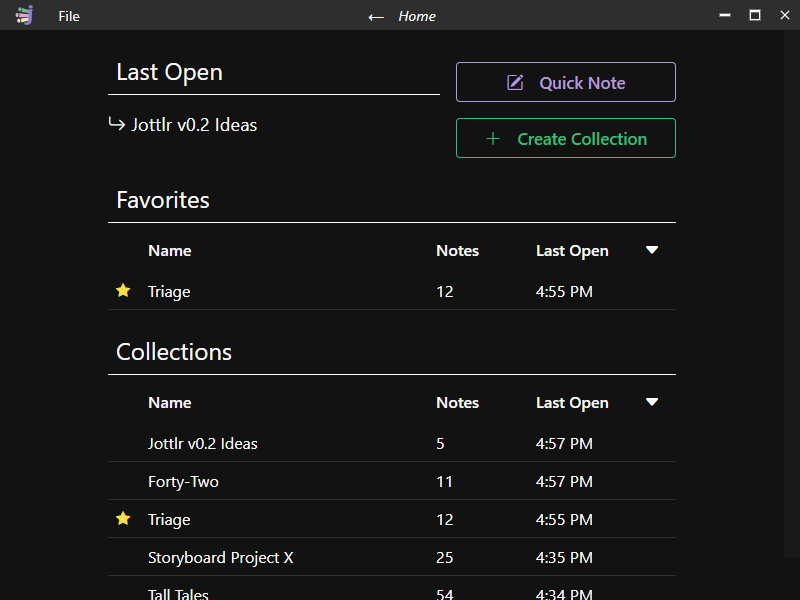
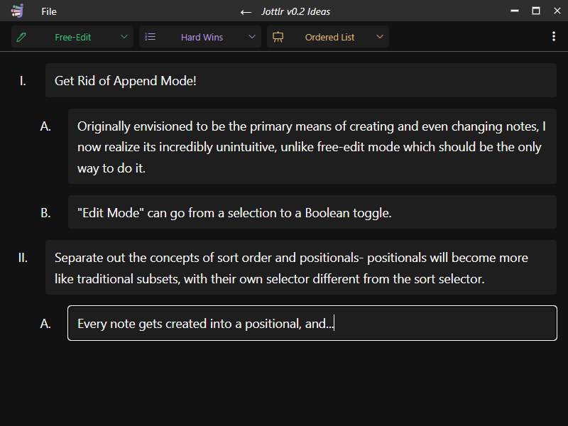
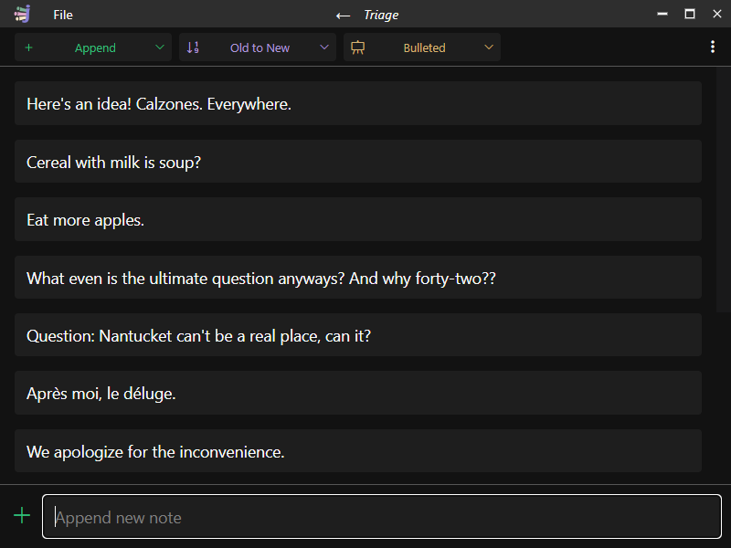
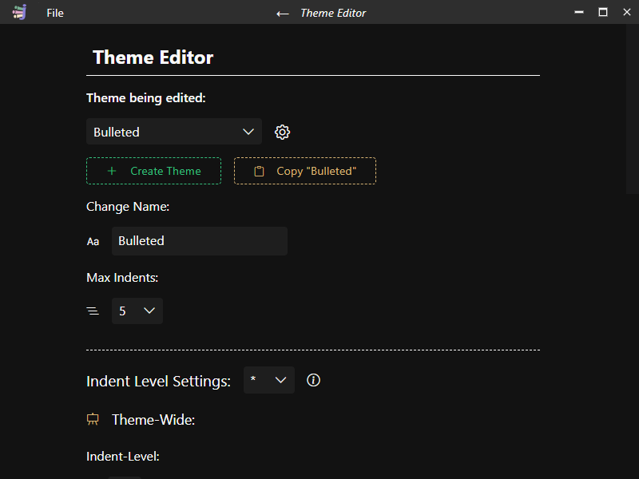

 **Jottlr** is a free, open source note-taking, list-making, and organization application. Jottlr lets you "jot down" ideas that are easily triaged into any number of collections (conceptually similar to notebooks). But unlike a notebook the notes in a collection can be quickly arranged and rearranged into any number of ordered subsets called positionals. Collections and their positionals can be displayed using any number of highly customizable themes. If you want ordered or unordered lists, or simple document like formats, Jottlr will let you do it with its built in theme editor.
 
 
### Home Screen:

  

### Free-Edit Mode:

  

### Append Mode:

  

### Theme Editor:

  

